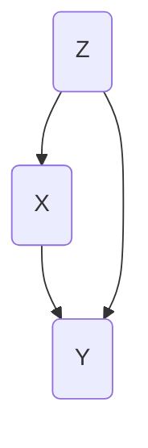

# causl
Methods for Specifying, Simulating from and Fitting Causal Models

## Basic Idea

This package enables one to simulate from a _frugal parameterization_, that is
one where we have a specific marginal causal quantity of interest and use something 
like a copula to model its dependence structure.  More details can be found in
Evans and Didelez (2024).

### Example: Marginal structural model



Suppose we have the causal model above, and are interested in a _marginal 
structural model_ (MSM):
$P(y \mid do(x)) = \sum_z P(z) \cdot P(y \mid z, x).$
A frugal parameterization for this quantity would be a parametric model for
$P(y \mid do(x))$, another for $P(z,x)$, and a third for the dependence between
$Y$ and $Z$ conditional on $X$.  We could use a (conditional) copula for this 
last model, or a conditional odds ratio if $Y$ and $Z$ are both discrete. 

One example would consist of setting
$Z \sim \text{Exp}(1)$, with $X \mid Z=z \sim N(z/2, 1)$
and $Y \mid do(X=x) \sim N((x-1)/2, 1)$,
with a Gaussian copula between $Z$ and $Y$ with correlation $\rho = 2\text{expit}(1) - 1$. 
(Note that, by default, we use the log link for the Gamma distribution.)

## Sample Code

We can specify such a marginal causal model with the following syntax.  
```
# formulae corresponding to covariates, treatments, outcomes and the dependence
forms <- list(Z ~ 1, X ~ Z, Y ~ X, ~ 1)
# vector of model families (3=gamma/exponential, 1=normal/Gaussian)
fam <- c(3, 1, 1, 1)
# list of parameters, including 'beta' (regression params) and 'phi' dispersion
pars <- list(Z = list(beta=log(1), phi=1),
             X = list(beta=c(0,0.5), phi=1),
             Y = list(beta=c(-0.5,0.5), phi=1),
             cop = list(beta=1))

# now simulate 100 observations
rfrugalParam(n=100, formulas=forms, pars=pars, family=fam)
```

### Reference

Evans, R.J. and Didelez, V.  Parameterizing and simulating from causal models
(with discussion). _Journal of the Royal Statistical Society, Series B_ (to 
appear), 2024.
